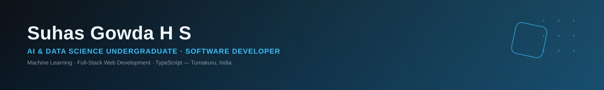

<div align="center">




<p>
<a href="https://github.com/suhasgowda46?tab=repositories"></a>
<a href="mailto:suhassgowdaa@gmail.com"></a>
<a href="https://github.com/suhasgowda46"></a>
<a href="https://github.com/suhasgowda46?tab=followers"></a>
<a href="https://github.com/suhasgowda46?tab=repositories"></a>
</p>

</div>

## 🧩 About

```txt
$ whoami
> Suhas Gowda H S — AI & Data Science undergraduate, SIT Tumakuru (CGPA 8.00)

$ focus
> Machine Learning · Full-Stack Web Development · TypeScript-based Applications

$ building
> PricePulse-AI — an AI-driven price tracking tool for smarter purchase decisions

$ learning
> Data Structures & Algorithms · DBMS · Operating Systems · AI Fundamentals

$ status
> Open to internships in Software Development & AI/ML
```

## 🚀 Featured Projects

**⭐ PricePulse-AI** — *AI-based price tracking application*
An AI-driven price tracking tool designed to monitor product prices and surface insights to support smarter purchase decisions.
`Python` `AI/ML`
🔗 [github.com/suhasgowda46/PricePulse-AI](https://github.com/suhasgowda46/PricePulse-AI)

| 🎯 HireSpark-AI | 🎬 Movie Recommendation Website | 📈 NNB-Traders |
|---|---|---|
| TypeScript-based application applying AI to streamline hiring and recruitment-related workflows. | A simple, modern movie recommendation site with a clean, responsive interface. | TypeScript-based trading-focused application with structured front-end/back-end logic. |
| `TypeScript` | `HTML` `CSS` `JavaScript` | `TypeScript` |
| [Repo →](https://github.com/suhasgowda46/hirespark-ai) | [Repo →](https://github.com/suhasgowda46/Movie-Recommendation-Website) | [Repo →](https://github.com/suhasgowda46/nnb-traders) |

## ⚙️ Tech Stack

<div align="center">

**💻 Languages**


<br/>

**🌐 Web Development**


<br/>

**🤖 AI / ML & Data**


<br/>

**🛠️ Tools & Platforms**


<br/><br/>

**📚 Core CS Foundations**


</div>

## 🎓 Education

**B.E. — Artificial Intelligence & Data Science**
Siddaganga Institute of Technology (SIT), Tumakuru
4th Semester (2nd Year) · CGPA: 8.00

## 📊 GitHub Stats

<div align="center">


<picture>
  <source media="(prefers-color-scheme: dark)" srcset="assets/github-contribution-grid-snake-dark.svg" />
  <source media="(prefers-color-scheme: light)" srcset="assets/github-contribution-grid-snake.svg" />
  
</picture>

</div>

## 🌐 Languages I Speak

Kannada · English · Hindi

## 🎨 Beyond Code

🎬 Watching movies · ✈️ Travelling and exploring new places · 🎵 Listening to music

## 📮 Let's Connect

<div align="center">

<a href="mailto:suhassgowdaa@gmail.com"></a>
<a href="https://linkedin.com/in/suhasgowdahs"></a>
<a href="https://github.com/suhasgowda46"></a>

<sub>Second-year AI & Data Science student · Open to internships in Software Development & AI/ML · MIT Licensed</sub>

</div>
